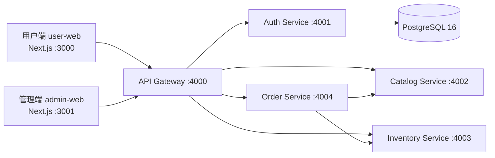
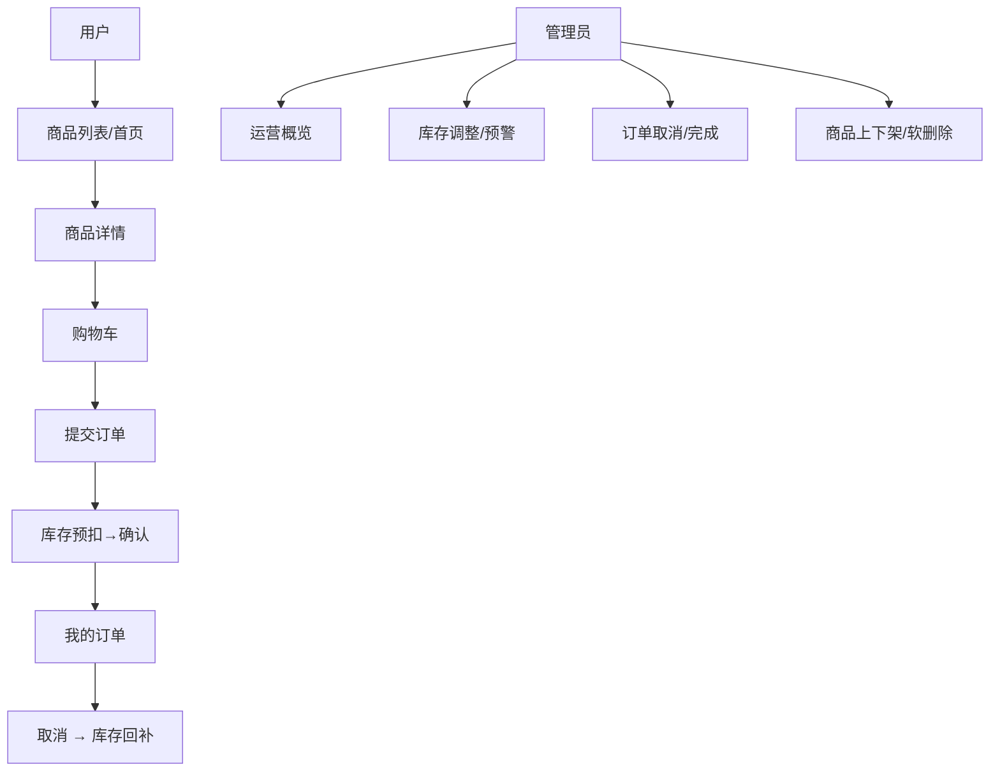
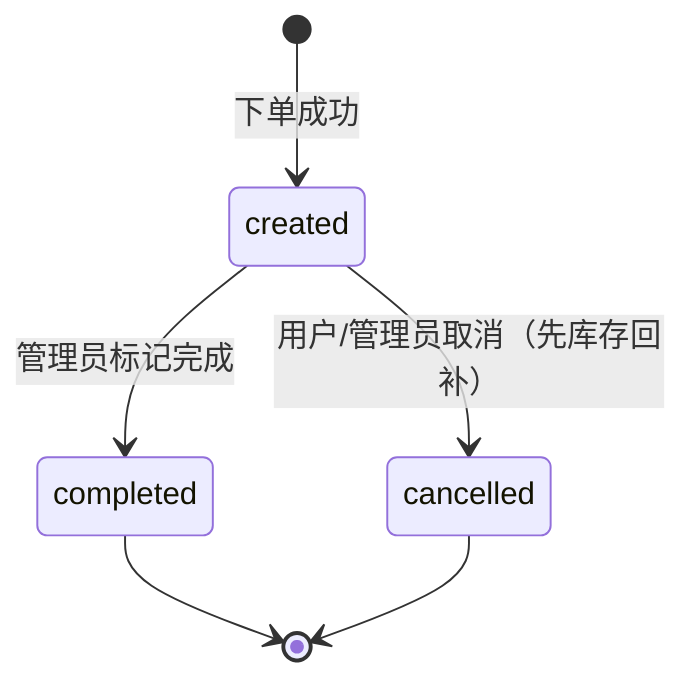

# PRD：生鲜电商微服务系统

状态：**v1.0（已竣工，与当前代码实现一致）**
目标：以微服务架构跑通「商品浏览 → 下单 → 扣库存 → 订单流转 → 后台运营」的交易闭环。

> 说明：本文档 v0.1 为开发前的设计草稿，v1.0 按实际交付实现修订（页面、接口、存储、状态机均与代码一致）。

## 1. 项目定位

一个用于练习微服务拆分与服务协作的生鲜电商系统。重点不在复杂运营，而在跑通：

- 商品浏览与软删除隔离
- 注册登录与 JWT 鉴权
- 下单、库存预扣/确认/回滚补偿
- 订单状态流转与库存回补
- 管理端商品、库存、订单运营

一句话定义：
做一个由网关、鉴权、商品、库存、订单协作完成交易闭环的生鲜电商微服务系统。

系统总览：



### 1.0 技术选型（实际采用）

| 层 | 技术 |
|---|---|
| 前端 | Next.js 14（App Router）、TypeScript、Tailwind CSS |
| 网关 / 服务 | Node.js 18 + Express、http-proxy-middleware |
| 鉴权 | JWT（jsonwebtoken）+ bcryptjs |
| 数据库 | PostgreSQL 16（用户服务）；商品/库存/订单当前为内存存储（MVP） |
| 编排 | Docker Compose（开发 `docker-compose.yml` / 生产 `docker-compose.prod.yml`） |
| CI/CD | GitHub Actions 构建镜像 → GHCR，服务器拉取部署 |

## 2. 目标用户与核心目标

目标用户：

- 普通用户：浏览商品、加购、下单、查看与取消自己的订单
- 管理员：商品增改/上下架/软删除、库存调整与预警、查看全部订单、取消订单、标记完成

核心目标：

- 用户下单链路完整可追踪
- 库存与订单状态强一致（失败必补偿、取消必回补、操作幂等）
- 每个服务业务边界清晰，可独立部署

## 3. 交付范围

已交付：

- API Gateway + Auth / Catalog / Inventory / Order 共 5 个后端服务
- 用户端（4 个页面）+ 管理端（4 个页面）
- 用户数据持久化（PostgreSQL），商品/库存/订单内存存储 + 种子演示数据
- Docker 一键编排、健康检查、GitHub Actions 镜像流水线
- 4 个验证脚本（冒烟、E2E、下单补偿、软删除）

明确不做（MVP 边界）：真实支付、优惠券/促销、秒杀、消息队列、分布式事务框架、商品/库存/订单的数据库持久化（已预留替换位置）。

## 4. 角色与权限

| 角色 | 权限 |
|------|------|
| 普通用户 | 浏览在售商品、下单、查看/取消自己的 `created` 订单 |
| 管理员 | 商品增改、上下架、软删除、库存调整、查看全部订单、取消任意订单、标记完成 |

- 演示账号：用户 `user@fresh.dev / user123`，管理员 `admin@fresh.dev / admin123`（auth-service 启动时自动 seed）
- 网关统一验签 JWT，向下游注入 `x-user-id` / `x-user-role`；下游服务不直接面向公网

## 5. 前端实现

实际交付 **2 个独立 Next.js 应用、8 个页面**（v0.1 规划的独立官网前台未建，商品列表即用户端首页）。

### A. 用户端 user-web（:3000）

| 页面 | 路径 | 核心功能 |
|---|---|---|
| 商品列表（首页） | `/` | 分类筛选、关键词搜索、商品卡片、加入购物车 |
| 商品详情 | `/products/:id` | 商品详情、库存状态、加入购物车、已删除商品 404 |
| 购物车 | `/cart` | 修改数量、删除、合计金额、提交订单 |
| 我的订单 | `/orders` | 订单列表、状态标签、取消订单 |
| 登录/注册 | `/login` | 双模式切换、登录态 localStorage 持久化 |

购物车存于浏览器 localStorage，无需登录即可加购，结算时要求登录。

### B. 管理端 admin-web（:3001）

| 页面 | 路径 | 核心功能 |
|---|---|---|
| 运营概览 | `/` | 在售/全部商品数、库存预警数、待处理订单数、订单总额 |
| 商品管理 | `/products` | 新增/编辑商品、上下架、软删除（含全部商品视图 `?all=true`） |
| 库存管理 | `/inventory` | 库存列表、低库存预警（≤10 件）、正负向调整 |
| 订单管理 | `/orders` | 全部订单、状态筛选、取消订单、标记完成 |
| 管理员登录 | `/login` | 仅 admin 角色可进入后台 |

关键用户链路：



## 6. 后端实现

### 6.1 服务拆分

| 服务 | 端口 | 职责 | 存储 |
|---|---|---|---|
| `api-gateway` | 4000 | 统一入口、JWT 验签、角色守卫、路径重写代理 | — |
| `auth-service` | 4001 | 注册、登录、当前用户、JWT 签发 | PostgreSQL |
| `catalog-service` | 4002 | 商品 CRUD、上下架、软删除、公开读/管理员全量 | 内存（种子 6 个商品） |
| `inventory-service` | 4003 | 库存查询、调整、预扣/确认/释放、回补 | 内存（种子 6 个 SKU） |
| `order-service` | 4004 | 下单编排、订单查询、取消/完成状态流转 | 内存（种子 2 个订单） |

统一响应结构：`{ code: 0, data, message }`，失败时 HTTP 状态码与 `code` 一致。

### 6.2 数据模型

仅 users 表已落库（auth-service 启动自动建表 + seed）：

```sql
users (
  id            text PRIMARY KEY,        -- u_admin / u_demo / u_xxxx
  email         text UNIQUE NOT NULL,
  password_hash text NOT NULL,           -- bcrypt
  role          text NOT NULL,           -- user | admin
  created_at    timestamptz DEFAULT now()
)
```

商品/库存/订单为内存结构，字段即对外 DTO：`products(id,name,category,priceCents,status,emoji,description)`、`inventory(productId,availableQuantity,reservedQuantity,lowStock)`、`orders(id,userId,items[],totalAmountCents,status,createdAt)`。订单行保存商品名称与价格**快照**，商品后续改名/删除不影响历史订单展示。

### 6.3 状态机

商品状态：`on（在售） ⇄ off（下架）`，任意状态 → `deleted（软删除，终态展示用，可由管理员改回 on 恢复）`

订单状态（流转不可逆）：



库存状态：`available` →（预扣）`reserved` →（确认）真实扣减 /（释放）回滚到 `available`；取消订单走独立的 `restock` 把已确认扣减加回。

## 7. 下单主链路与一致性规则

`POST /api/orders` 编排：

1. Gateway 验签 JWT，注入 `x-user-id`
2. Order 逐项调 Catalog 校验商品存在且 `status=on`，并以**服务端价格**汇总（已删除/下架商品拒绝下单）
3. Order 调 Inventory 预扣（整体校验，任一不足则全部不扣，返回 409）
4. Order 本地创建订单（`created`）
5. 调 Inventory 确认扣减；**确认失败则先释放预扣再撤销订单**，返回 500

取消订单：**先调 `/restock` 回补库存，成功后才置 `cancelled`**；回补失败订单保持 `created` 可重试；`restockApplied` 标志防止重复回补（幂等）。

关键规则：

- 库存不足直接失败，不产生部分预扣
- 非 `created` 状态不能取消/完成（返回 400）
- 用户只能操作自己的订单，管理员可操作任意订单（权限隔离）
- 软删除商品对普通用户 404，管理员经 `?all=true` 可见；删除接口幂等

## 8. 接口清单（经 Gateway）

| 方法 | 路径 | 鉴权 | 说明 |
|---|---|---|---|
| POST | `/api/auth/register` | 无 | 注册，返回 token + user |
| POST | `/api/auth/login` | 无 | 登录 |
| GET | `/api/auth/me` | 用户 | 当前用户 |
| GET | `/api/catalog/products` | 可选 | 列表，支持 `category/keyword/all` |
| GET | `/api/catalog/products/:id` | 可选 | 详情（删除品对非管理员 404） |
| POST | `/api/admin/products` | 管理员 | 新增商品 |
| PATCH | `/api/admin/products/:id` | 管理员 | 编辑/上下架 |
| DELETE | `/api/admin/products/:id` | 管理员 | 软删除（幂等） |
| GET | `/api/inventory` | 公开 | 库存列表（含 lowStock） |
| PATCH | `/api/inventory/:productId` | 管理员 | 库存调整 `{adjustment}` |
| POST | `/api/orders` | 用户 | 创建订单 |
| GET | `/api/orders/my` | 用户 | 我的订单 |
| GET | `/api/orders/:id` | 用户/管理员 | 订单详情（属主或管理员） |
| POST | `/api/orders/:id/cancel` | 用户/管理员 | 取消（先回补库存，幂等） |
| POST | `/api/admin/orders/:id/complete` | 管理员 | 标记完成 |
| GET | `/api/admin/orders` | 管理员 | 全部订单 |

服务间内部接口（不经 Gateway）：Inventory `POST /reserve`、`POST /confirm`、`POST /release`、`POST /restock`。

下单请求示例：

```json
POST /api/orders
{ "items": [{ "productId": "p-tomato", "quantity": 2 }] }
```

## 9. 非功能要求与落地情况

- 本地一键启动：`docker compose up` 起全栈，或 `npm run dev:services` + 两个前端
- 生产部署：`docker-compose.prod.yml`，仅前端暴露端口，后端/PG 只走 compose 内网；全部服务 `restart: always` + 健康检查 + 依赖顺序启动
- CI/CD：push main 自动构建 7 个镜像推送 GHCR（`latest` + `sha-*` 标签），服务器 `pull && up -d`
- 关键链路补偿：确认失败回滚、取消先回补、重复操作幂等
- 验证脚本：`scripts/smoke-test.mjs`、`verify-e2e.mjs`、`verify-order-flow.mjs`、`verify-soft-delete.mjs`

已知限制（后续迭代）：

- catalog/inventory/order 为内存存储，服务重建后数据回到种子状态（用户数据不受影响）
- 库存记录未与商品软删除联动，已删除商品的库存仍显示在管理端（建议加标记或过滤）
- 暂无 HTTPS 域名与速率限制，演示环境通过内网端口访问

## 10. 开发顺序回顾

1. Monorepo（npm workspaces）与 Gateway
2. Auth 服务（内存→PG 双存储）
3. Catalog 与 Inventory
4. Order 下单闭环与补偿
5. 用户端与管理端
6. 软删除、取消回补、幂等等一致性加固
7. Docker Compose、健康检查、GitHub Actions 与生产部署
