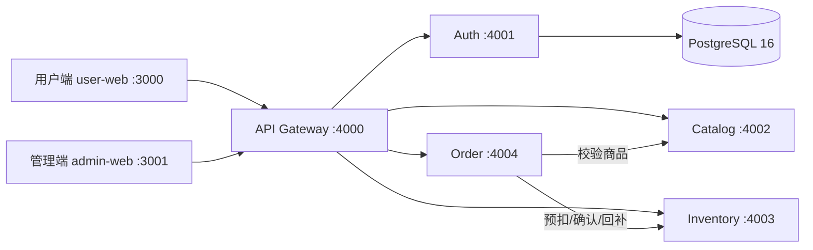

# 鲜达生鲜 · 生鲜电商微服务系统

一个以**交易闭环与数据一致性**为核心的微服务练手项目：API Gateway + 鉴权/商品/库存/订单 4 个领域服务 + 用户端/管理端 2 个 Next.js 应用，Docker Compose 一键编排，GitHub Actions 自动构建镜像。

## 在线演示

| 入口 | 地址 | 账号 |
|---|---|---|
| 用户端 | http://nas.qich.top:13000/ | `user@fresh.dev / user123`（也可自行注册） |
| 管理端 | http://nas.qich.top:13001/ | `admin@fresh.dev / admin123` |

> 演示环境部署于内网 NAS，需在对应网络环境访问。若管理端地址无法打开，请在 NAS 端口映射中补充 `13001 → 容器 3001`。

推荐演示路径：用户端浏览商品 → 加购下单 → 我的订单取消（观察库存回补）；管理端查看库存预警 → 调整库存 → 商品软删除（用户端即时 404）→ 订单标记完成。

## 功能特性

- **鉴权与权限隔离**：JWT 签发/验签，网关统一鉴权并向下游注入身份；用户与管理员接口分级保护
- **交易闭环**：下单时校验商品状态 → 库存预扣 → 落订单 → 确认扣减；任一步失败自动补偿回滚
- **库存强一致**：取消订单先回补库存再改状态，`restockApplied` 防重复回补；库存不足整单失败不产生部分扣减
- **订单状态机**：`created → completed / cancelled`，非 created 状态拒绝变更，越权操作返回 403
- **商品软删除**：删除后普通用户 404、管理员 `?all=true` 可见，删除幂等；历史订单保留商品名称/价格快照
- **双前端**：用户端（商品/购物车/订单）、管理端（运营概览/商品/库存/订单）
- **工程化**：PostgreSQL 持久化用户数据、容器健康检查、GHCR 镜像流水线（`latest` + `sha-*` 可回滚）

## 架构



| 服务 | 端口 | 说明 |
|---|---|---|
| api-gateway | 4000 | 统一入口、JWT 验签、角色守卫、反向代理 |
| auth-service | 4001 | 注册/登录/当前用户，PostgreSQL 存储，启动自动建表与 seed |
| catalog-service | 4002 | 商品 CRUD、上下架、软删除（内存 + 种子数据） |
| inventory-service | 4003 | 库存查询/调整、预扣/确认/释放/回补（内存 + 种子数据） |
| order-service | 4004 | 下单编排、订单查询、取消/完成（内存 + 种子数据） |
| user-web | 3000 | Next.js 用户端 |
| admin-web | 3001 | Next.js 管理端 |

> 商品/库存/订单为 MVP 内存存储，容器重建后回到种子数据；用户数据持久化在 PostgreSQL。

## 目录结构

```
.
├── apps/
│   ├── user-web/          # Next.js 用户端
│   └── admin-web/         # Next.js 管理端
├── services/
│   ├── api-gateway/       # 网关
│   ├── auth-service/      # 鉴权（PG）
│   ├── catalog-service/   # 商品
│   ├── inventory-service/ # 库存
│   └── order-service/     # 订单
├── scripts/               # smoke-test / verify-e2e / verify-order-flow / verify-soft-delete
├── docker-compose.yml       # 本地开发编排
├── docker-compose.prod.yml  # 生产编排（GHCR 镜像 + 健康检查）
├── .github/workflows/       # CI：构建 7 个镜像推送 GHCR
└── PRD.md                   # 产品需求文档（v1.0 竣工版）
```

## 本地启动

### 方式一：Docker Compose（推荐）

```bash
# 可选：docker-compose.yml 中 auth 默认使用内存存储；
# 如需 PostgreSQL，在该文件 postgres 与 auth-service 已预置，按需启动
docker compose up -d
```

### 方式二：Node 直接运行（需 Node.js ≥ 18）

```bash
npm install                       # 安装 workspaces 全部依赖

# 终端 1：5 个后端服务（4000-4004）
npm run dev:services
# 终端 2 / 3：两个前端
npm run dev:user                  # http://localhost:3000
npm run dev:admin                 # http://localhost:3001
```

### 验证脚本

```bash
npm run smoke                     # 冒烟测试
node scripts/verify-e2e.mjs           # 端到端主链路
node scripts/verify-order-flow.mjs    # 下单/取消/补偿/幂等
node scripts/verify-soft-delete.mjs   # 软删除权限隔离
```

## 生产部署

镜像由 GitHub Actions 在 push 到 main 后自动构建并推送至 GHCR：
`ghcr.io/chen1998-create/fresh-{auth,catalog,inventory,order,gateway,user-web,admin-web}`

服务器（已装 Docker）：

```bash
git clone https://github.com/CHEN1998-create/fresh-microservices.git
cd fresh-microservices
cp .env.example .env
# 编辑 .env：填入 JWT_SECRET（openssl rand -hex 32）与 POSTGRES_PASSWORD（openssl rand -hex 16）

docker compose -f docker-compose.prod.yml pull
docker compose -f docker-compose.prod.yml up -d
docker compose -f docker-compose.prod.yml ps   # 全部 healthy/running
```

- 仅前端 3000/3001 映射宿主机，后端与 PostgreSQL 只走 compose 内网
- 更新版本：`git pull && docker compose -f docker-compose.prod.yml pull && up -d`
- 回滚：将镜像标签由 `latest` 改为对应的 `sha-xxxx`
- 前端网关地址在**镜像构建期**通过 `--build-arg API_GATEWAY_URL` 固化（Next.js rewrites 为 build-time）

## 技术栈

Node.js 18 · Express · http-proxy-middleware · JWT · bcryptjs · node-postgres · Next.js 14 · TypeScript · Tailwind CSS · PostgreSQL 16 · Docker Compose · GitHub Actions / GHCR

## 文档

- [PRD.md](./PRD.md) — 产品需求文档（页面、接口清单、状态机、一致性规则）
